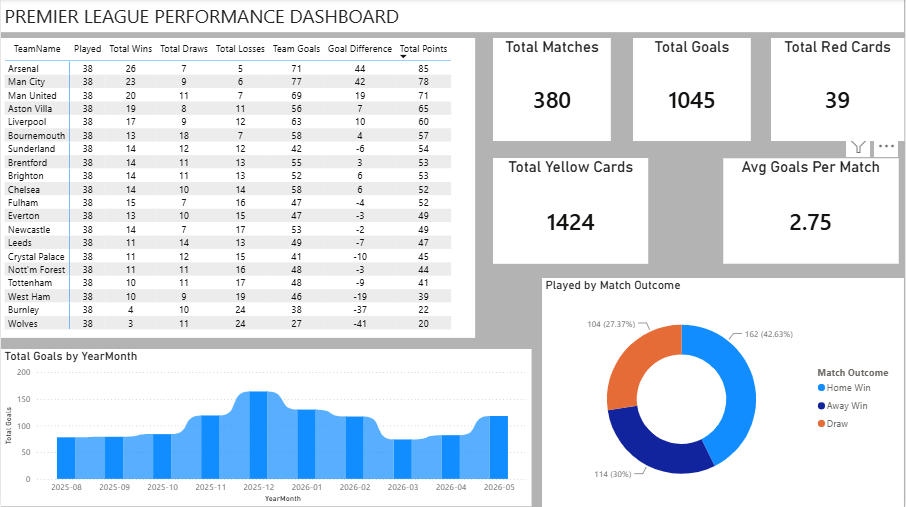
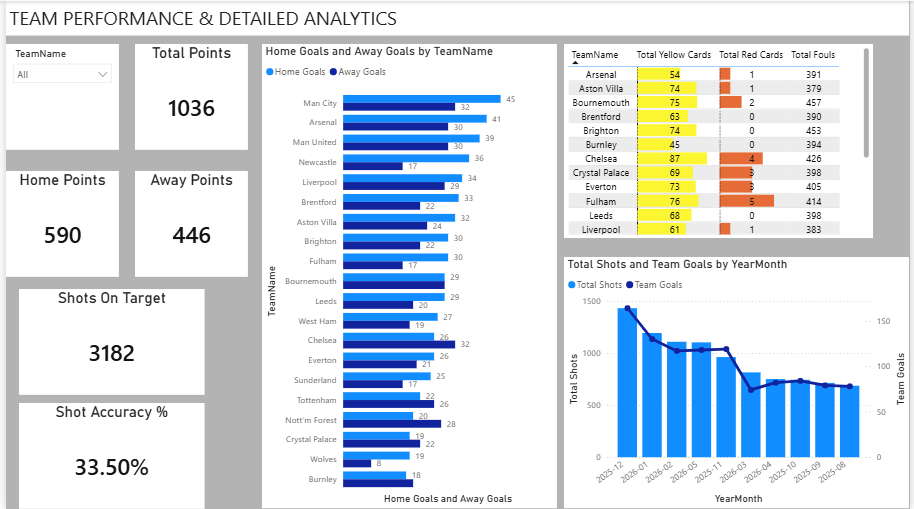
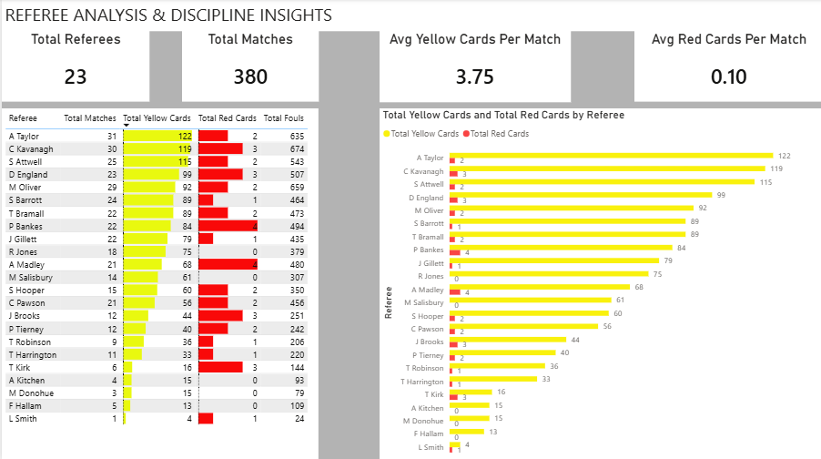

# ⚽ Premier League Analytics & Performance Dashboard (Power BI)

An end-to-end Power BI analytics project providing comprehensive insights into Premier League match performance, team efficiency, and referee discipline dynamics across full seasons.

---

## 📸 Executive Summary & Dashboard Preview

### 1. Executive Overview

* **Key Focus:** Season standings, overall wins/losses,overall wins/losses, home vs. away points distribution, and core league KPIs.

### 2. Team Performance & Detailed Analytics

* **Key Focus:** Dynamic team-level deep dives, home vs. away goal comparisons, shot conversion accuracy, and team discipline records.

### 3. Referee Analysis & Discipline Insights

* **Key Focus:** Referee strictness metrics, yellow/red card distributions per match, and total fouls committed.

---

## 🏗️ Data Architecture & Modeling

The project utilizes a **Star Schema** data model designed for scalable aggregations and complex relationship filtering.

- **Fact Table:** `FactMatches` (contains match events, goals, shots, fouls, and cards).
- **Dimension Tables:** `DimTeams`, `DimCalendar`, `DimReferee`.
- **Relationships:** Dual active/inactive relationships between `DimTeams` and `FactMatches` (Home vs. Away team contexts) managed via advanced DAX filtering and `CROSSFILTER`.

---

## 💡 Key DAX Measures & Logic

To prevent double-counting and accurately evaluate team performance regardless of match location (Home/Away), key measures were constructed handling active and inactive relationships:

* **Dynamic Home & Away Goals Aggregation:**
```dax
Home Goals = 
VAR SelectedTeam = SELECTEDVALUE('DimTeams'[TeamName])
RETURN
CALCULATE(
    SUM('FactMatches'[FTHG]),
    'FactMatches'[HomeTeam] = SelectedTeam,
    REMOVEFILTERS('DimTeams')
)

Away Goals = 
VAR SelectedTeam = SELECTEDVALUE('DimTeams'[TeamName])
RETURN
CALCULATE(
    SUM('FactMatches'[FTAG]),
    'FactMatches'[AwayTeam] = SelectedTeam,
    REMOVEFILTERS('DimTeams')
)

​Shot Accuracy Percentage:
Shot Accuracy % = DIVIDE([Shots On Target], [Total Shots], 0)

​Referee Card Averages:
Avg Yellow Cards Per Match = DIVIDE([Total Yellow Cards], [Total Matches], 0)


🎨 UI/UX & Visualization Standards
​Color Palette: Dark modern theme with high-contrast accent colors for KPIs and metrics.
​Layout: Standardized grid layout, centered column alignment, and custom conditional formatting (Data Bars).
​Interactivity: Dynamic slicers, cross-filtering across visuals, and clear metric hierarchy.

​🛠️ Tools & Technologies Used
​Power BI Desktop: Dashboard development, visual formatting, and storytelling.
​DAX (Data Analysis Expressions): Complex calculations, inactive relationship management, and performance measures.
​Power Query (M): ETL processes, data cleaning, and data type standardization.

Premier-League-Performance-PowerBI/
│
├── 📊 Premier_League_Analytics.pbix   <-- ملف الباور بي آي
│
├── 📁 Data/                            <-- مجلد ضع فيه ملف/ملفات الإكسل أو ה-CSV المستوردة
│
└── 📁 Screenshots/                     <-- مجلد ضع فيه الصور الثلاث التي أخذتها
    ├── Executive_Overview.png
    ├── Team_Performance.png
    └── Referee_Discipline.png


## 🛡️ License

This project is licensed under the MIT License. You are free to use, modify, and share this project with proper attribution.

## 🌟 About Me

Hi there! I'm Ahmed Alnaggar. I'm a data analyst.
